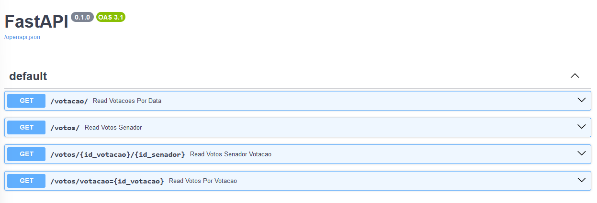

# votos-senado-api

## Como rodar o servidor localmente 💻
Para rodar o servidor, basta instalar as dependencias que estão no [Pipfile](./Pipfile) usando ``pipenv install`` em seguida rode e é esperado o seguinte resultado:
    
    pipenv shell
    uvicorn src.main:app --reload

    INFO:     Uvicorn running on http://127.0.0.1:8000 (Press CTRL+C to quit)
    INFO:     Started reloader process [28720]
    INFO:     Started server process [28722]
    INFO:     Waiting for application startup.
    INFO:     Application startup complete.

## Como acessar o front-end localmente 📲

Enquanto estiver rodando a API localmente, acesse: http://127.0.0.1:8000/docs#/

